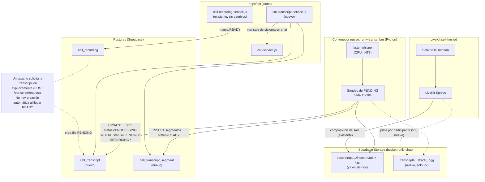
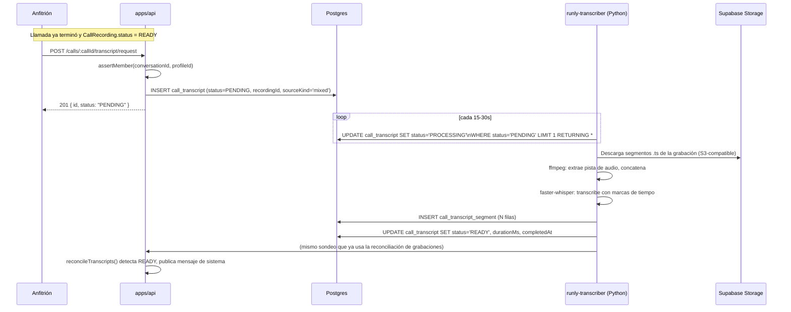
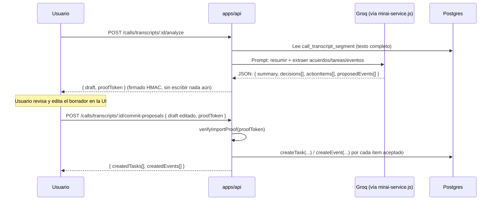

# Especificación técnica: transcripción de llamadas (runly.chat)

**Fecha:** 2026-09-24 (revisión 3 — V1 ya implementado y verificado, ver `docs/TASKS.md`; esta revisión solo completa el diseño de V2 pendiente de la Etapa 3, sin código nuevo)
**Estado:** V1 implementado. V2 (esta revisión): diseño de datos y arquitectura completo y listo para la Etapa 0/1 de validación contra LiveKit real — ver el registro de cambios de la revisión 3 para qué sigue genuinamente bloqueado por esa validación y qué ya se resolvió por análisis del contrato documentado de la API de LiveKit Egress
**Depende de:** `docs/TRANSCRIPTION_CURRENT_STATE.md` (auditoría del estado real del repositorio)
**Módulo:** `runly.chat` (extensión de `runly.calls`, no un módulo RME3 nuevo — ver §0.3)

## Registro de cambios (revisión 3)

Sesión de 2026-09-24, a petición explícita del usuario tras cerrar V1 y la función de texto a voz de MirAI: "empezar el spec [de V2] ahora" — documento solamente, sin implementación. Un repaso de la Etapa 3 del plan (`TRANSCRIPTION_IMPLEMENTATION_PLAN.md`) mostró que ya dejaba explícitamente pendiente una decisión de modelo de datos ("`call_transcript_track`... decisión de diseño a resolver en esta etapa, no en el spec, porque depende de cómo se comporte `startTrackEgress` en la prueba real"). Esa premisa era parcialmente incorrecta: **la necesidad de una tabla auxiliar no depende de ningún comportamiento no documentado de esta versión de LiveKit** — se deriva directamente del contrato ya público de `EgressClient.startTrackEgress`: cada llamada crea un trabajo de egress independiente con su propio `egress_id`, estado y ciclo de vida (igual que ya hace `startRoomCompositeEgress` para `CallRecording`, solo que aquí son N trabajos por transcripción en vez de uno). Esa parte se resuelve aquí, por análisis, no por prueba:

- **Resuelto por análisis (nuevo en esta revisión)**: modelo `CallTranscriptTrack` (§3.1) — una fila por pista/`egressId`, con su propio `status` (mismo vocabulario que `CallRecording.status`: `STARTING`/`ACTIVE`/`PROCESSING`/`READY`/`FAILED`) para que una pista pueda fallar sin invalidar las demás.
- **Sigue genuinamente bloqueado por una prueba en vivo** (sin cambios respecto a la revisión 2): la calidad/formato real del audio que produce `startTrackEgress` en la versión de LiveKit Egress que usa esta instancia (`v1.9.0`), el costo real de CPU de N pistas simultáneas, y si el alineamiento de marca de tiempo entre pistas es lo bastante preciso para intercalar segmentos sin desfase perceptible. Nada de esto se puede validar sin una llamada real con LiveKit self-hosted — no se inventan cifras aquí (mismo principio que ya se siguió en la Etapa 1 de V1 con faster-whisper).

## Registro de cambios (revisión 2)

Tras revisar la revisión 1 de este documento, el usuario tomó las siguientes decisiones de dirección, incorporadas en esta revisión. Se distingue explícitamente entre **decisión técnica ya justificable** (se documenta como resuelta) y **política de producto que sigue pendiente de aprobación explícita antes de construir la API de producción** (se documenta como dirección adoptada, no como aprobación final) — ver `docs/TRANSCRIPTION_OPEN_QUESTIONS.md` para el estado exacto de cada una:

1. **Creación de trabajos**: solo por solicitud explícita del usuario (`POST .../transcript/request`). Se elimina de este documento cualquier sugerencia de creación automática al llegar `CallRecording.status = READY` — la revisión 1 tenía una flecha de "trigger automático" en el diagrama de arquitectura que contradecía el contrato de API descrito en la misma revisión; queda corregido en §2.
2. **Acceso a transcripciones**: más estricto que el de grabaciones — participantes reales de esa llamada específica + usuarios expresamente autorizados, no "cualquier miembro actual de la conversación" (§5.1, dirección adoptada, validación final pendiente).
3. **Privilegios de PostgreSQL del contenedor transcriptor**: rol dedicado de mínimo privilegio, diseñado en este documento (§5.4), sin implementarse durante la PoC de la Etapa 1.
4. **Recuperación de trabajos interrumpidos**: mecanismo de arrendamiento (lease) + latido (heartbeat) + escritura idempotente, nuevo §5.6, diseñado antes de construir el worker de producción.
5. **Retención independiente**: la transcripción ya no expira automáticamente junto con su grabación de origen — retención propia y configurable (§5.7). El valor numérico por defecto sigue pendiente de aprobación.
6. **Motor de transcripción sustituible**: `TRANSCRIPTION_MODE` se mantiene en 2 valores (`local`/`disabled`) — no se expone un tercer valor no funcional. La sustituibilidad se resuelve con una abstracción interna, no con configuración visible de algo no implementado (§6).
7. **Tareas propuestas por MirAI**: el usuario elige el proyecto en cada tarea; si la conversación no tiene proyecto, MirAI puede igualmente generar minuta/acuerdos sin forzar la creación de tareas (§7).

---

## 0. Contexto y decisiones de arquitectura fundamentales

### 0.1. Qué se puede reutilizar sin tocarlo

La grabación de llamadas (`CallRecording`, `call-recording-service.js`) ya produce, para cualquier llamada grabada, un HLS (audio+video mezclados) en Supabase Storage, bucket `runly-chat`, prefijo `recordings/<conversationId>/<recordingId>/`. **La transcripción V1 no necesita ninguna captura de audio nueva** — puede extraer el audio directamente de los segmentos `.ts` ya generados. Esto responde directamente a la pregunta clave de la Fase 1 del encargo original: **sí, es posible generar transcripciones a partir de las grabaciones actuales sin modificar el flujo de grabación existente.**

Esto tiene una consecuencia de diseño importante que se documenta explícitamente aquí en vez de dejarla implícita: **en V1, la transcripción depende de que exista una `CallRecording` en estado `READY`.** Si nadie activó "Grabar" durante la llamada, no hay audio del que partir. Esta dependencia se resuelve en V2 (ver §0.2) desacoplando la captura de audio de la grabación de video.

### 0.2. Identificación de participantes — decisión de arquitectura

El encargo original pide evaluar tres alternativas. Aquí está la recomendación, justificada contra lo que el código realmente permite (§1.3/§2.8 de `TRANSCRIPTION_CURRENT_STATE.md`):

- **Alternativa A (audio mezclado, sin identificación)** — se implementa siempre, como mecanismo de respaldo universal. Cualquier `CallRecording` en `READY` puede transcribirse así, sin depender de nada nuevo.
- **Alternativa B (pistas individuales de LiveKit)** — **es la recomendación principal para identificar hablantes**, no la Alternativa C. Razón: Runly ya tiene una asignación de identidad limpia y confiable entre la pista de audio de LiveKit y una persona real — `CallParticipant.livekitIdentity` (= `userId`) y `CallGuest.livekitIdentity` (`guest_<uuid>`, con `displayName` conocido) — algo que **ninguna diarización acústica puede igualar en confiabilidad**. El SDK de servidor de LiveKit que Runly ya usa (`livekit-server-sdk`, `EgressClient`) expone `startTrackEgress`/`startTrackCompositeEgress`, simplemente nunca invocados hoy. La captura de pista de solo-audio es egress ligero (sin el Chrome headless que sí necesita la composición de video de sala completa), por lo que el costo de CPU adicional por participante debería ser bajo comparado con la inferencia de Whisper — **esto debe medirse en la Etapa 1 del plan de implementación, no asumirse**.
- **Alternativa C (diarización con pyannote.audio)** — se documenta pero **no se recomienda como mecanismo principal**. Motivos: (1) es estrictamente inferior a la Alternativa B cuando la Alternativa B está disponible, porque Runly ya tiene la verdad de quién es cada pista; (2) pyannote requiere descargar modelos con condiciones de licencia en Hugging Face (no es simplemente `pip install`), y su rendimiento en CPU sin GPU es notablemente más lento que en GPU — un costo de infraestructura adicional no trivial en un VPS de 4 vCPU que ya corre LiveKit + Egress + Postgres + la API; (3) sumaría una segunda dependencia de modelo de IA (además de Whisper) al mismo contenedor o a uno nuevo. Se mantiene documentada como **mitigación de respaldo únicamente para el caso mixto sin captura por pista** (por ejemplo, grabaciones históricas anteriores a esta función, o llamadas con invitados donde la captura por pista no se activó) — explícitamente fuera de alcance de V1/V2.

**Conclusión de arquitectura**: dos niveles de servicio, no una sola alternativa binaria.
1. **V1 — Transcripción básica (Alternativa A)**: reutiliza la grabación existente, sin atribución de hablante. Bajo riesgo, cero cambios a Egress.
2. **V2 — Transcripción con hablantes reales (Alternativa B)**: introduce captura de audio por participante vía `startTrackEgress`, desacoplada de si el video se está grabando o no. Cada intervención se atribuye a la identidad real de LiveKit ya mapeada en `CallParticipant`/`CallGuest`.
3. **Diarización acústica (Alternativa C)**: documentada como extensión futura opcional, no planificada.

Casos límite explícitamente aceptados en V2 (según lo pedido en el encargo): dos personas compartiendo un mismo micrófono/pista aparecerán como un solo "hablante" (la identidad de esa pista); varias personas hablando a la vez sobre pistas distintas se transcriben en paralelo con marcas de tiempo superpuestas (correcto, no es un error); audio captado por el micrófono de otra persona (bleed) puede en teoría producir texto duplicado o mal atribuido — no se intenta resolver mediante reconocimiento de voz biométrico, que queda explícitamente fuera de alcance por instrucción del encargo.

### 0.3. Frontera de módulo

`runly.chat`/`runly.calls` es un módulo core respaldado por Prisma, no un módulo custom RME3 (ver `TRANSCRIPTION_CURRENT_STATE.md` §5.7). Por lo tanto:
- `CallTranscript`/`CallTranscriptSegment` son **modelos Prisma ordinarios** en `prisma/schema.prisma`, con migración nueva — nunca `defineModel`/RME3.
- Se accede vía `prisma.callTranscript.*` normal, nunca `$queryRaw`, salvo en los mismos puntos donde el código existente ya usa SQL crudo por necesidad (joins contra `chat_conversation_members`, igual que hace `call-recording-service.js`).

### 0.4. Procesamiento asíncrono — patrón elegido

El repositorio no tiene ninguna cola fuera de proceso ni Redis a nivel de aplicación (`TRANSCRIPTION_CURRENT_STATE.md` §3.2). El único patrón real de "trabajo de IA en segundo plano" es **fila de base de datos como cola** (OCR de recibos PFM: columna `status` + contador de intentos + sondeo periódico). Se elige explícitamente **no introducir Redis/BullMQ/RabbitMQ**, por instrucción directa del encargo ("evita introducir una nueva infraestructura de colas si el proyecto ya dispone de un mecanismo adecuado") y porque no hay necesidad real a esta escala.

Diferencia clave respecto al precedente de PFM: el trabajo pesado (inferencia de Whisper) no puede correr dentro de `apps/worker` (Node.js) — necesita un proceso Python separado. Se decide que **el contenedor de transcripción sondea Postgres directamente** (su propia conexión, no vía la API ni el worker Node), reutilizando el patrón de "reclamar una fila atómicamente" en vez de introducir un contrato HTTP nuevo entre Node y Python. Ver §3 para el detalle y §2 de `TRANSCRIPTION_OPEN_QUESTIONS.md` para las alternativas descartadas y por qué.

---

## 1. Requisitos

### 1.1. Funcionales (V1)

1. Un usuario con permiso de transcripción puede solicitar la transcripción de una llamada que ya tiene una `CallRecording` en `READY`.
2. El sistema transcribe el audio extraído de esa grabación usando faster-whisper, en español (y otros idiomas soportados por el modelo multilingüe) con marcas de tiempo por segmento.
3. La transcripción resultante es consultable desde la conversación de chat asociada, con estado visible (pendiente/procesando/lista/fallida).
4. Cualquier miembro activo de la conversación puede leer una transcripción lista (mismo nivel de acceso que las grabaciones — ver §5.1 para la discusión de si esto debe ser más estricto).
5. Una transcripción fallida puede reintentarse.
6. Las transcripciones expiran junto con (o antes que) su grabación de origen — no sobreviven indefinidamente al audio del que provienen.

### 1.2. Funcionales (V2)

7. Cuando el organizador activa "transcripción con identificación de hablantes" (distinta de "grabar video"), el sistema captura audio por participante vía LiveKit Egress de pista.
8. Los segmentos de la transcripción muestran el nombre real del participante (o invitado) que habló, usando la identidad ya mapeada en `CallParticipant`/`CallGuest` — sin reconocimiento de voz biométrico.
9. La transcripción con hablantes está disponible aunque el organizador no haya activado la grabación de video de sala completa.

### 1.3. No funcionales

- No debe degradar el rendimiento de llamadas/grabaciones en curso — el procesamiento es exclusivamente posterior a que la llamada termine (por instrucción explícita: nada de subtítulos en tiempo real).
- Debe operar sin GPU, en CPU, con límites explícitos de CPU/RAM (no existe precedente de esto en el repo — ver `TRANSCRIPTION_CURRENT_STATE.md` §3.4 — se introduce aquí por primera vez).
- Debe ser una funcionalidad opcional a nivel de instancia (algunas instalaciones de Runly no tendrán 16GB de RAM ni 4 vCPU).
- No debe requerir un servicio de pago por minuto como dependencia obligatoria.
- Debe mantener el aislamiento multiempresa existente (ver §5).
- El costo real de CPU/tiempo de procesamiento se mide en la Etapa 1 del plan de implementación — este documento no inventa cifras de rendimiento.

---

## 2. Arquitectura propuesta



### 2.1. Flujo V1 (sin identificación de hablantes)



### 2.2. Flujo V2 (con identificación de hablantes)

Igual al anterior, salvo que `startRecording`-equivalente (`call-transcript-service.js`) llama `EgressClient.startTrackEgress` una vez por cada pista de audio activa en la sala (una por `CallParticipant`/`CallGuest` con micrófono publicado), etiquetando cada salida con la identidad de LiveKit en el nombre del objeto y registrando una fila `CallTranscriptTrack` (§3.1) por cada llamada a `startTrackEgress` — cada una con su propio `egressId` y `status`, para que una pista pueda fallar sin invalidar las demás. El transcriptor procesa cada pista por separado y en el paso de fusión intercala los segmentos de todas las pistas por marca de tiempo absoluta, asignando `speakerUserId`/`speakerGuestId` según a cuál pista pertenece cada segmento — sin ejecutar ningún modelo de diarización.

---

## 3. Modelo de datos

### 3.1. Nuevos modelos Prisma

```prisma
enum CallTranscriptSourceKind {
  MIXED      // Alternativa A: audio de la grabación de sala completa
  PER_TRACK  // Alternativa B: pistas individuales por participante
}

model CallTranscript {
  id               String   @id @default(dbgenerated("uuidv7()")) @db.Uuid
  callId           String   @db.Uuid @map("call_id")
  conversationId   String   @db.Uuid @map("conversation_id") // denormalizado, mismo motivo que CallRecording
  companyId        String   @db.Uuid @map("company_id")      // directo, mismo patrón que ChatMiraiRun (no transitivo)
  recordingId      String?  @db.Uuid @map("recording_id")    // null si el origen es captura por pista sin grabación de video
  sourceKind       CallTranscriptSourceKind @default(MIXED) @map("source_kind")
  status           String   @default("PENDING") @map("status") // PENDING | PROCESSING | READY | FAILED
                                                                 // string libre, igual que CallRecording.status
  requestedByUserId String  @db.Uuid @map("requested_by_user_id")
  model            String?  @map("model")           // ej. "faster-whisper-small-int8" (ver Etapa 1: "small" supera a "base" en audio real, no solo "base" como se asumió inicialmente)
  language         String?  @map("language")        // código detectado o forzado, ej. "es"
  attempts         Int      @default(0) @map("attempts")
  failureReason    String?  @map("failure_reason")
  startedAt        DateTime? @map("started_at")
  completedAt      DateTime? @map("completed_at")
  durationMs       Int?     @map("duration_ms")
  // Retención DESACOPLADA de CallRecording.expiresAt (revisión 2 — ver §5.7).
  // Se fija al completarse (READY), a partir de una duración configurable
  // (InstanceConfig, no una constante fija como en CallRecording), no al
  // valor de expiresAt de la grabación de origen.
  expiresAt        DateTime? @map("expires_at")
  // Arrendamiento (lease) para recuperación de trabajos interrumpidos — ver §5.6.
  // Ambos nulos en PENDING; se fijan al reclamar el trabajo y se renuevan
  // periódicamente mientras el contenedor sigue vivo procesándolo.
  leaseExpiresAt   DateTime? @map("lease_expires_at")
  workerInstanceId String?  @map("worker_instance_id") // identificador libre del contenedor (hostname/PID), solo diagnóstico
  createdAt        DateTime @default(now()) @map("created_at")

  call      Call             @relation(fields: [callId], references: [id], onDelete: Cascade)
  recording CallRecording?   @relation(fields: [recordingId], references: [id], onDelete: SetNull)
  requestedBy UserProfile    @relation("CallTranscriptRequestedBy", fields: [requestedByUserId], references: [id])
  segments  CallTranscriptSegment[]

  @@index([callId])
  @@index([conversationId])
  @@index([companyId, createdAt])
  @@index([status])
  @@index([expiresAt])
  @@map("call_transcript")
}

model CallTranscriptSegment {
  id             String   @id @default(dbgenerated("uuidv7()")) @db.Uuid
  transcriptId   String   @db.Uuid @map("transcript_id")
  startMs        Int      @map("start_ms")
  endMs          Int      @map("end_ms")
  text           String   @map("text")
  speakerLabel   String?  @map("speaker_label")     // nombre resuelto o "Hablante 1" si no hay atribución
  speakerUserId  String?  @db.Uuid @map("speaker_user_id")
  speakerGuestId String?  @db.Uuid @map("speaker_guest_id")
  confidence     Float?   @map("confidence")
  createdAt      DateTime @default(now()) @map("created_at")

  transcript   CallTranscript @relation(fields: [transcriptId], references: [id], onDelete: Cascade)
  speakerUser  UserProfile?   @relation(fields: [speakerUserId], references: [id])
  speakerGuest CallGuest?     @relation(fields: [speakerGuestId], references: [id])

  @@index([transcriptId, startMs])
  @@map("call_transcript_segment")
}

// V2 (Etapa 3) — nuevo en la revisión 3. Una fila por cada `startTrackEgress`
// invocado para una transcripción PER_TRACK, no una por transcripción: N
// participantes con micrófono publicado = N trabajos de egress
// independientes, cada uno con su propio `egress_id`/estado/ciclo de vida
// (mismo principio que ya usa CallRecording.egressId para una composición de
// sala completa, aquí multiplicado por pista). Sin esta tabla, una sola fila
// CallTranscript no podría representar "3 de 4 pistas ya listas, 1 todavía
// activa, 1 falló" al mismo tiempo.
model CallTranscriptTrack {
  id              String   @id @default(dbgenerated("uuidv7()")) @db.Uuid
  transcriptId    String   @db.Uuid @map("transcript_id")
  egressId        String   @map("egress_id")             // EgressInfo.egress_id de LiveKit — clave para reconciliar contra ListEgress
  livekitIdentity String   @map("livekit_identity")        // CallParticipant.livekitIdentity o CallGuest.livekitIdentity (`guest_<uuid>`)
  speakerUserId   String?  @db.Uuid @map("speaker_user_id")
  speakerGuestId  String?  @db.Uuid @map("speaker_guest_id")
  objectKey       String?  @map("object_key")             // ej. recordings/transcripts/<conversationId>/<callId>/track_<livekitIdentity>.ogg — null hasta READY
  // Mismo vocabulario de string libre que CallRecording.status (no un enum
  // nuevo) — STARTING (egress solicitado) -> ACTIVE (grabando) -> PROCESSING
  // (llamada terminó, Egress todavía finalizando/subiendo) -> READY|FAILED.
  status          String   @default("STARTING") @map("status")
  failureReason   String?  @map("failure_reason")
  durationMs      Int?     @map("duration_ms")
  createdAt       DateTime @default(now()) @map("created_at")
  completedAt     DateTime? @map("completed_at")

  transcript   CallTranscript @relation(fields: [transcriptId], references: [id], onDelete: Cascade)
  speakerUser  UserProfile?   @relation(fields: [speakerUserId], references: [id])
  speakerGuest CallGuest?     @relation(fields: [speakerGuestId], references: [id])

  // Una pista por identidad de LiveKit por transcripción — si alguien se
  // reconecta a mitad de llamada, se decide en la Etapa 3 (tras la prueba en
  // vivo) si eso reutiliza la fila existente o crea una segunda pista para la
  // misma identidad; no se asume aquí sin haber visto el comportamiento real
  // de reconexión de Egress.
  @@unique([transcriptId, livekitIdentity])
  @@index([status])
  @@map("call_transcript_track")
}
```

Notas de diseño:
- `status` como `String` libre, no enum — igual que `CallRecording.status`, por consistencia y para no requerir migración al añadir estados futuros.
- `companyId` directo (no solo vía `conversationId`) — sigue el patrón de `ChatMiraiRun`, que el auditor señaló como el modelo correcto a imitar quando se necesitan consultas a nivel de instancia sin join.
- `recordingId` nullable porque en V2 puede no existir una `CallRecording` de video (captura de solo audio).
- Borrado en cascada desde `Call` (si se borra la llamada, se borra la transcripción — coherente con `CallRecording`).

### 3.2. Migración

`CallTranscript`/`CallTranscriptSegment` ya están aplicados en producción (migraciones `20260924000000_add_call_transcript`/`20260924000001_call_transcript_finalized_at`, V1). `CallTranscriptTrack` (§3.1, nuevo en la revisión 3) **todavía no tiene migración** — es diseño únicamente hasta que la Etapa 3 confirme contra LiveKit real que este modelo de una fila por pista es correcto; sin columnas añadidas a tablas existentes, aditiva de bajo riesgo cuando se cree, mismo perfil que `20260913120000_add_call_recording`.

---

## 4. Contrato de API

Todos los endpoints en `apps/api/src/routes/calls/index.js`, delegando a un nuevo `call-transcript-service.js` (mismo patrón que `call-recording-service.js`).

| Método y ruta | Permiso | Gate adicional | Descripción |
|---|---|---|---|
| `POST /calls/:callId/transcript/request` | `chat.calls.transcript.request` (nuevo, ver §5.2) | `assertMember` | Crea la fila `PENDING`. 409 si ya existe una activa para ese `callId`. 422 si no hay `CallRecording` en `READY` (V1) |
| `GET /calls/conversations/:conversationId/transcripts` | ninguno a nivel de ruta | `assertMember` | Lista transcripciones de la conversación (mismo nivel que `listRecordings`) |
| `GET /calls/transcripts/:transcriptId` | ninguno a nivel de ruta | `assertMember` (derivado de `conversationId` propio de la fila) | Detalle + segmentos ordenados |
| `POST /calls/transcripts/:transcriptId/retry` | `chat.calls.transcript.request` | `assertMember` | Reintenta una transcripción `FAILED` (resetea a `PENDING`, incrementa `attempts`) |
| `DELETE /calls/transcripts/:transcriptId` | `chat.calls.transcript.request` | `assertMember` | Borrado manual |

Respuestas de error siguen el mismo formato que `CallRecordingError` (`{message, status}`).

### 4.1. Contrato del SDK

`packages/sdk/src/domains/calls.js`: `requestTranscript(callId)`, `listTranscripts(conversationId)`, `getTranscript(transcriptId)`, `retryTranscript(transcriptId)`, `deleteTranscript(transcriptId)`.

### 4.2. Contrato interno transcriptor ↔ Postgres

El contenedor `runly-transcriber` no expone ni consume ninguna API HTTP de Runly — accede directamente a Postgres con una credencial propia y acotada (rol de mínimo privilegio, ver §5.4) y a Supabase Storage con las mismas credenciales S3-compatibles que ya usa Egress (`SUPABASE_S3_*`).

**Reclamo atómico de trabajo, con soporte de arrendamiento (lease) para recuperar trabajos abandonados** (diseño completo en §5.6 — esta consulta reemplaza la versión simplificada de la revisión 1, que no contemplaba qué pasa si el contenedor se reinicia a mitad de un trabajo):

```sql
UPDATE call_transcript
SET status = 'PROCESSING',
    started_at = coalesce(started_at, now()),
    attempts = attempts + 1,
    lease_expires_at = now() + interval '10 minutes',
    worker_instance_id = $1
WHERE id = (
  SELECT id FROM call_transcript
  WHERE status = 'PENDING'
     OR (status = 'PROCESSING' AND lease_expires_at < now())  -- lease vencido: se asume abandonado
  ORDER BY created_at ASC
  LIMIT 1
  FOR UPDATE SKIP LOCKED
)
RETURNING *;
```

`FOR UPDATE SKIP LOCKED` deja el diseño seguro desde el día uno si en el futuro se escala a más de un contenedor transcriptor concurrente, sin necesitar coordinación adicional. La condición `lease_expires_at < now()` es lo que permite que un segundo contenedor (o el mismo, tras reiniciarse) retome un trabajo cuyo dueño anterior desapareció sin marcar `READY`/`FAILED`.

---

## 5. Seguridad y multiempresa

### 5.1. Acceso — dirección adoptada: más estricto que grabaciones

**Decisión de dirección (revisión 2, validación final pendiente antes de producción — ver `TRANSCRIPTION_OPEN_QUESTIONS.md` §1):** a diferencia de `listRecordings` (solo `assertMember` — cualquier miembro *actual* de la conversación, sin importar si participó en esa llamada), la lectura de una transcripción se restringe a:

1. Quien la solicitó (`requestedByUserId`), o
2. Un usuario que efectivamente fue participante de **esa llamada específica** — es decir, existe una fila `CallParticipant` con `callId` = el de la transcripción y `userId` = el del solicitante (no basta con ser miembro *hoy* de la conversación si no estuvo en la llamada), o
3. Un usuario con el permiso de administración `chat.calls.transcript.manage` (ver §5.2) — el mismo criterio de "anfitrión/administrador puede ver todo lo que ocurrió en su conversación" ya usado para gestionar invitados (`assertCanManageCall`).

Esto cierra explícitamente el caso que motivó el cambio: alguien que se une a un canal **después** de que ocurrió una reunión no hereda automáticamente acceso a transcripciones históricas de reuniones en las que no estuvo, aunque hoy sí heredaría acceso a las grabaciones de esas mismas reuniones (comportamiento de `listRecordings` sin cambios — fuera de alcance de este documento).

**Caso de invitados externos (`CallGuest`)**: un invitado no tiene cuenta ni sesión persistente en Runly más allá de la llamada — no hay una superficie natural donde ofrecerle "consultar la transcripción después". Se propone que los invitados **no** tengan acceso posterior a la transcripción por ningún medio (ni siquiera reenviándoles un enlace), a diferencia de las grabaciones, que sí pueden compartirse vía el enlace de la llamada mientras esté vigente. Esta asimetría es intencional dado que el texto es más fácil de extraer/reenviar que un video — se señala explícitamente como parte de la propuesta, pendiente de que el usuario la confirme.

**Regla explícita para evitar fuga de identificador**: nunca se debe poder acceder a una transcripción solo por conocer su `id` (o el de su `callId`/`conversationId`) — el chequeo de participación real en la llamada de §5.1 puntos 1-3 es obligatorio en cada lectura, no solo en la creación.

### 5.2. Permisos — dos, no uno

Se introducen dos permisos nuevos en `apps/api/src/permission-catalog.js`, grupo `chat`, junto a `chat.calls.record`:

| Permiso | Gatea |
|---|---|
| `chat.calls.transcript.request` | Solicitar (`POST .../request`) y reintentar (`POST .../retry`) una transcripción — análogo a `chat.calls.record` para grabación |
| `chat.calls.transcript.manage` | Borrar cualquier transcripción de una conversación que administra, y **leer** cualquier transcripción de esa conversación aunque no haya sido participante de esa llamada puntual (ver §5.1 punto 3) — pensado para roles de administración/cumplimiento, no para el usuario común |

Un usuario sin ningún permiso especial, pero que sí participó en la llamada, puede leer su propia transcripción sin necesitar `chat.calls.transcript.manage` (criterio §5.1 punto 2) — el permiso de gestión es solo para el caso de acceso *ampliado*, no para el acceso *básico* de un participante real.

### 5.3. Patrón `assertTranscriptAccess` (extiende `assertMember`)

Se introduce `assertTranscriptAccess(transcriptId, profileId)` en `call-transcript-service.js`, en vez de reutilizar `assertMember` sin modificar — implementa exactamente la regla de §5.1 (participó en la llamada, o la solicitó, o tiene `chat.calls.transcript.manage`), no simplemente "es miembro de la conversación". Igual que en `call-recording-service.js`, nunca se confía en el `companyId`/`userId` del token del llamante más allá de para identificar quién es — el `companyId` efectivo siempre se deriva de la fila real (`conversationId` de la transcripción), nunca de un parámetro de la solicitud.

### 5.4. Rol de PostgreSQL dedicado y de mínimo privilegio para el transcriptor

**Decisión de dirección (revisión 2): se diseña aquí, se implementa en una etapa posterior del plan — nunca durante la PoC aislada de la Etapa 1.** El contenedor `runly-transcriber` **no** debe recibir la misma `DATABASE_URL` de privilegio completo que usan `apps/api`/`apps/worker`. Se define un rol de Postgres nuevo, aprovisionado por un script SQL idempotente en el instalador (mismo espíritu que la función `runly_chat_user_access(...)` ya existente):

```sql
-- Aprovisionado una sola vez por el instalador, idempotente (CREATE ROLE IF NOT EXISTS-equivalente).
CREATE ROLE runly_transcriber LOGIN PASSWORD '<generada por el instalador>';

-- Escritura acotada exactamente a las dos tablas nuevas.
GRANT SELECT, INSERT, UPDATE, DELETE ON call_transcript, call_transcript_segment TO runly_transcriber;

-- Lectura de solo lo necesario para resolver identidades de hablante y ubicar el audio de origen.
GRANT SELECT ON call, call_participant, call_guest, call_recording, user_profile TO runly_transcriber;

-- Explícitamente SIN acceso a cualquier otra tabla del esquema (finance, hr, contacts, etc.).
```

Este rol se aprovisiona vía una nueva migración de infraestructura (no una migración Prisma — Prisma no modela roles de Postgres) o un script dedicado en `infra/installer/`, ejecutado una vez por instalación y de forma segura ante reejecuciones. La contraseña se genera y almacena igual que las credenciales de LiveKit (`crypto.randomBytes`, nunca hardcodeada, nunca impresa en logs). El contenedor recibe su propia cadena de conexión (`TRANSCRIBER_DATABASE_URL`), distinta de `DATABASE_URL`.

**Explícitamente fuera de alcance de la PoC de la Etapa 1**: durante la Etapa 1, el script de prueba no toca Postgres en absoluto (opera sobre un archivo de audio local, ver `TRANSCRIPTION_IMPLEMENTATION_PLAN.md` Etapa 1) — este rol solo es necesario a partir de la etapa que conecta el contenedor a la base de datos real.

### 5.5. Auditoría

A diferencia de la brecha detectada en grabación (§5.5 de `TRANSCRIPTION_CURRENT_STATE.md`), este diseño **sí incluye desde el inicio** escritura a `AuditLog` para `chat.call_transcript.request`/`retry`/`delete`, siguiendo el patrón `logAudit()` documentado.

### 5.6. Recuperación de trabajos interrumpidos (arrendamiento / lease)

Añadido en la revisión 2 — la revisión 1 usaba `FOR UPDATE SKIP LOCKED` para evitar que dos contenedores reclamaran el mismo trabajo, pero no resolvía qué pasa si el contenedor que ya reclamó un trabajo se cae o pierde conexión a mitad de la transcripción. Diseño completo:

- **Arrendamiento con vencimiento** (`leaseExpiresAt`, §3.1): al reclamar una fila `PENDING`, el trabajo pasa a `PROCESSING` con `leaseExpiresAt = now() + 10 minutos`. La consulta de reclamo (§4.2) también considera reclamables las filas `PROCESSING` cuyo `leaseExpiresAt` ya venció — se asume que su dueño anterior desapareció sin completar ni fallar el trabajo.
- **Latido (heartbeat) durante el procesamiento**: mientras el contenedor sigue vivo procesando un trabajo legítimamente largo, renueva `leaseExpiresAt = now() + 10 minutos` cada ~2 minutos (`UPDATE call_transcript SET lease_expires_at = ... WHERE id = $1 AND status = 'PROCESSING'`). Esto evita que un trabajo real pero lento (ej. una reunión de 3 horas) sea reclamado por error por otro contenedor mientras sigue procesándose de forma sana. El intervalo de 10 minutos de vencimiento vs. 2 minutos de renovación deja margen de sobra para una pausa transitoria sin perder el trabajo.
- **Escritura idempotente de resultados**: antes de insertar los segmentos finales, el contenedor borra cualquier segmento previamente escrito para ese `transcriptId` (`DELETE FROM call_transcript_segment WHERE transcript_id = $1`) dentro de la misma transacción que el `INSERT` masivo de los nuevos y el `UPDATE ... SET status='READY'`. Esto hace que, si un trabajo fue reclamado dos veces por error (ej. el dueño original en realidad seguía vivo pero con el latido caído por un problema de red transitorio, y su lease venció), el segundo intento en completarse deja el resultado correcto sin duplicar segmentos — no se intenta prevenir la doble ejecución en sí (eso ya lo hace el lease + `FOR UPDATE SKIP LOCKED`), se diseña para que sea inofensiva si ocurre en el borde.
- **Errores transitorios vs. definitivos**: `attempts` se incrementa en cada reclamo (igual que hoy en el diseño de la revisión 1). Un error de descarga de Storage o de conexión a Postgres se trata como transitorio — la fila vuelve a `PENDING` (no a `FAILED`) si `attempts < MAX_ATTEMPTS` (3, igual que el precedente de OCR de recibos PFM), permitiendo que el mismo contenedor u otro lo reintente en el siguiente ciclo de sondeo. Un error de decodificación de audio (archivo corrupto, formato no soportado) se trata como definitivo — pasa directo a `FAILED` con `failureReason`, sin agotar reintentos que no van a cambiar el resultado. Esta distinción se implementa como una categoría interna del manejo de excepciones del contenedor Python, no como una columna nueva en el modelo de datos (no se anticipa la necesidad de consultarla desde la API).
- **Limpieza de archivos temporales**: el contenedor descarga audio a un directorio temporal efímero (`/tmp/<transcriptId>/`, existente solo dentro del ciclo de vida del contenedor) y lo elimina explícitamente al finalizar cada trabajo (éxito o fallo) — nunca depende únicamente de que el contenedor se reinicie para liberar espacio, ya que un contenedor de larga vida procesando muchos trabajos secuenciales podría acumular archivos sin este paso explícito.
- **Transcripción borrada o acceso revocado mientras se procesa**: si `DELETE /calls/transcripts/:id` se ejecuta mientras el contenedor tiene esa fila en `PROCESSING`, el `UPDATE ... WHERE id = $1` final del contenedor (a `READY` o `FAILED`) simplemente afecta 0 filas — Postgres no lanza error, solo no actualiza nada. El contenedor debe verificar el conteo de filas afectadas y, si es 0, registrar el evento y descartar el resultado sin reintentar ni fallar el proceso — la fila ya no existe, no hay nada que actualizar. Este comportamiento se prueba explícitamente en la Etapa 2 del plan de implementación (no en la Etapa 1, que no toca Postgres).

### 5.7. Retención — independiente de la grabación de origen, configurable

**Cambio respecto a la revisión 1** (que fijaba `CallTranscript.expiresAt = CallRecording.expiresAt`): la transcripción ahora tiene su propia política de retención, desacoplada de la del audio/video del que proviene, porque su valor de consulta futura (minutas, acuerdos) puede superar largamente la utilidad de conservar el video pesado original.

- **Mecanismo**: un valor de retención en días, leído de `InstanceConfig` (tabla clave-valor ya existente y usada en el repo — ver `growth-retention-worker.js` para el patrón exacto de lectura/escritura vía `prisma.instanceConfig.findUnique`/`upsert`), bajo una clave nueva (ej. `transcription.retentionDays`). Si no está configurada, se usa un valor por defecto.
- **Limitación reconocida del mecanismo elegido**: `InstanceConfig` es una tabla **a nivel de instancia**, no por empresa — todas las empresas de una misma instalación de Runly compartirían la misma política de retención de transcripciones. Si en el futuro se necesita una política distinta por empresa, haría falta una columna nueva en `Company` (o una tabla de configuración por empresa que hoy no existe) — se señala aquí como una limitación conocida del diseño actual, no como algo resuelto.
- **Valor numérico por defecto**: **pendiente de aprobación explícita** — no se fija en este documento (ver `TRANSCRIPTION_OPEN_QUESTIONS.md` §6, revisado). No se asume retención indefinida ni se reutiliza automáticamente el número de la grabación (90 días) sin que el usuario lo confirme como intencional para transcripciones también.
- **Limpieza**: reutiliza el mismo job horario de `call-recording-service.js` extendido (`cleanupExpiredTranscripts()`), pero con su propia condición de expiración — nunca infiere el vencimiento a partir de una `CallRecording` que ya pudo haber sido borrada. Borrado físico de filas (`call_transcript` + sus `call_transcript_segment` en cascada) — no hay objetos de Storage propios que limpiar en V1, el texto vive únicamente en Postgres.
- **Distinción explícita entre tres cosas que expiran por separado** (pedida directamente por el usuario): (1) el audio/video original (`CallRecording`, 90 días fijos, sin cambios), (2) la transcripción de texto (`CallTranscript`, retención propia configurable, este documento), (3) cualquier análisis futuro generado por MirAI a partir de la transcripción (§7 — sin modelo de datos propio todavía, ya que esa integración es una etapa posterior; cuando exista, deberá tener su propia política, no heredar implícitamente la de `CallTranscript`).

---

## 6. Infraestructura y despliegue (resumen — detalle en el plan de implementación)

- Nuevo servicio Docker `runly-transcriber`, perfil `transcription` (mismo patrón de perfil opt-in que `livekit-egress`).
- Variable de entorno `TRANSCRIPTION_MODE ∈ {local, disabled}` — **decisión confirmada en la revisión 2: solo estos dos valores, no un tercero `api`/`external` todavía.** El usuario pidió explícitamente no exponer configuración que aparente ofrecer una funcionalidad no implementada. La sustituibilidad futura del motor (por ejemplo, un proveedor externo de pago para instalaciones sin recursos para correr Whisper localmente) se resuelve con una **abstracción interna** en `call-transcript-service.js`/el contenedor (una interfaz de "motor de transcripción" con una única implementación real hoy, `faster-whisper` local) — de forma que añadir un segundo motor más adelante sea extender esa interfaz, no rediseñar el contrato de datos ni la API pública. Esto deja la puerta abierta técnicamente sin publicitar nada que no funciona.
- Límites explícitos de CPU/RAM en `deploy.resources.limits` — primer precedente de este patrón en el repo.
- Volumen con nombre para cachear el modelo de Whisper entre actualizaciones (`whisper-model-cache`).
- Instalador: nueva función `resolveTranscriptionConfig()` en `infra/installer/lib/`, calcada de `resolveLiveKitConfig()`.

---

## 7. Integración futura con MirAI (preparación, no implementación)

Basado en el precedente real más fuerte encontrado (§4.5 de `TRANSCRIPTION_CURRENT_STATE.md`): el flujo `recognize`/`commit` de importación de estados de cuenta en `runly.ledger`.



Puntos de diseño ya resueltos por el código existente, reutilizables directamente:
- `signImportProof`/`verifyImportProof` (`apps/api/src/routes/ledger/ai-import-token.js`) — mecanismo de token firmado con TTL, sin cambios.
- `CalendarEvent.sourceModule`/`sourceEntityId` — ya soporta etiquetar un evento como originado por `runly.chat`/una conversación específica.
- `createTask`/`createEvent` — funciones de servicio existentes, sin modificar; el nuevo endpoint solo las invoca tras la confirmación del usuario.

**Decisión de dirección confirmada en la revisión 2** (resuelve la pregunta abierta original sobre `Task.projectId`): el usuario elige manualmente el proyecto en la pantalla de revisión de propuestas, por cada tarea aceptada, cada vez — se descarta vincular una conversación a un proyecto por adelantado o crear una lista de tareas genérica sin proyecto. **Si la conversación/reunión no está asociada a ningún proyecto, MirAI debe poder generar igualmente un resumen/minuta y una lista de acuerdos en texto plano, sin forzar al usuario a crear tareas formales** — la creación de `Task`s reales es un enriquecimiento opcional del resultado, nunca un requisito para obtener valor de la transcripción vía MirAI. Esto implica que la pantalla de revisión de propuestas (Etapa 5 del plan) debe distinguir claramente "acuerdos/resumen" (siempre disponible, sin dependencias) de "tareas propuestas" (solo accionable si el usuario elige un proyecto por cada una).

**Explícitamente fuera de alcance de esta fase** (por instrucción directa del encargo): no se crea ningún evento/tarea automáticamente sin confirmación humana explícita.

---

## 8. Clasificación de UI: imprescindible vs. posterior

**Imprescindible (V1):**
- Botón "Solicitar transcripción" en la vista de detalle de la llamada/grabación.
- Estado visible (pendiente/procesando/lista/fallida) con opción de reintentar.
- Vista de transcripción con marcas de tiempo, dentro de la conversación (mismo patrón que `ChatRecordingsGallery`).
- Aviso de que la llamada se transcribirá (mismo tratamiento que el aviso de grabación, no descartable mientras esté activo).

**Posterior:**
- Búsqueda de texto dentro de la transcripción.
- Copiar/exportar texto.
- Corrección manual de contenido por el usuario.
- Identificación visual por color/avatar de cada hablante (V2).
- Integración con MirAI (§7).
- Consulta optimizada para móvil.

---

## 9. Riesgos

1. **Rendimiento parcialmente medido, no completamente cerrado**: la Etapa 1 ya produjo cifras reales — incluyendo una corrida directamente en el VPS KVM4 real (ver `scripts/poc-transcription/RESULTS.md`) — que cambiaron la recomendación inicial de `base` a `small` (mejor calidad y no más lento en audio real) y revelaron que `--cpu-threads` debe fijarse explícitamente en producción. Sigue faltando medir con una reunión de duración típica (10-20 min) y con contención real de LiveKit/Egress activos simultáneamente — no se fija ninguna cifra de este documento como definitiva hasta cerrar esos dos puntos.
2. **Contención de recursos con LiveKit/Egress**: un contenedor de Whisper sin límites podría dejar sin CPU a una grabación o llamada en curso. Mitigación: límites explícitos de CPU/RAM desde el primer despliegue (§6), y procesamiento estrictamente secuencial (un trabajo a la vez) en V1.
3. **Dependencia de la grabación en V1**: si el organizador no activó "Grabar", no hay transcripción posible. Se documenta como limitación conocida de V1, resuelta en V2.
4. **Captura por pista (V2) es trabajo nuevo no probado**: aunque LiveKit lo soporta, Runly nunca lo ha usado — la Etapa 3 del plan debe validar esto en un entorno de prueba antes de considerarlo listo para producción.
5. **Sin precedente de límites de recursos ni caché de modelo en el instalador**: ambos se introducen por primera vez aquí — mayor superficie de error en la primera implementación del instalador que en una extensión de un patrón ya probado.
6. **Consideraciones legales de grabar/transcribir sin consentimiento explícito**: igual que la grabación, se requiere un aviso persistente y no descartable; la validación de cumplimiento legal específico por país queda fuera de alcance, responsabilidad del cliente que despliega la instancia (mismo criterio ya aplicado al diseño de grabación).
7. **Aprovisionamiento del rol de PostgreSQL de mínimo privilegio (§5.4) es trabajo nuevo para el instalador**: a diferencia de credenciales de aplicación (que ya se generan y escriben en `.env` de forma rutinaria), crear un rol de base de datos con `GRANT`s específicos es un tipo de paso que el instalador nunca ha ejecutado antes. Mitigación: diseñarlo como un script SQL idempotente, probado explícitamente en una instalación limpia y en una actualización de una instancia existente (Etapa 2/4 del plan), antes de considerarlo listo.
8. **El mecanismo de arrendamiento (§5.6) es la primera vez que este código usa `FOR UPDATE SKIP LOCKED` y vencimiento de lease**: sin precedente directo en el repo para verificar contra un caso real de uso en producción. Mitigación: la Etapa 2 del plan incluye una prueba de concurrencia explícita (dos contenedores contra la misma fila) y una prueba explícita de "contenedor muere a mitad de un trabajo" antes de darlo por validado.
