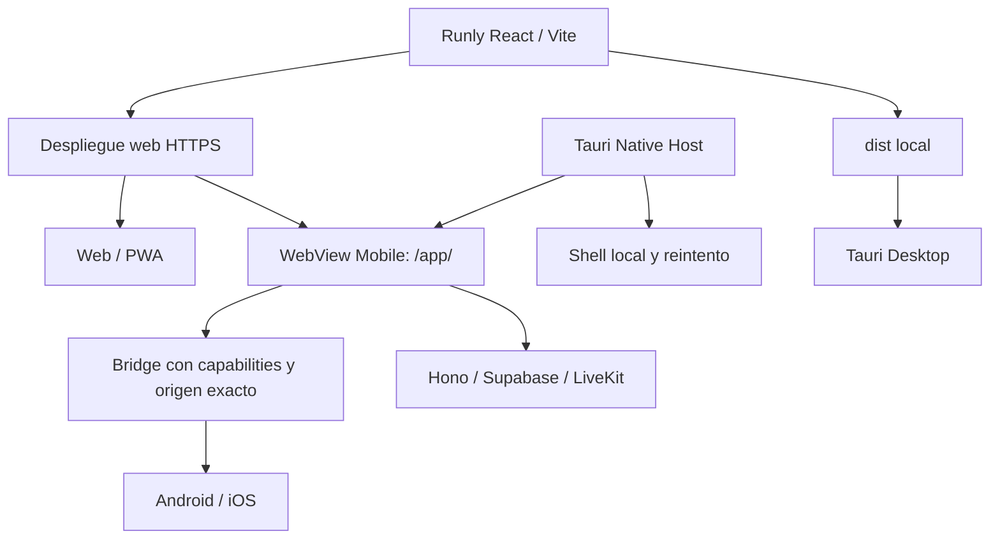

# Runly Native Host

## Android 1.1.0 — llamadas y pantalla (2026-09-12)

El host añade captura nativa con MediaProjection y LiveKit Android 2.28.2 (Kotlin 2.2.21). El participante auxiliar `screen:<profileId>` publica exclusivamente video de pantalla en la sala existente; no adquiere audio, cámara ni suscripciones. La API exige pertenencia a la conversación, llamada activa y participante JOINED para emitir un token de un minuto limitado a SCREEN_SHARE. Los participantes auxiliares no cuentan como personas ni disparan sonidos de entrada/salida. Web/Desktop conservan `getDisplayMedia`.

Los avisos locales ahora usan canales Android con importancia alta, sonido y vibración, IDs estables para retirarlos al responder/terminar, icono Atlas y un PendingIntent con URI validada. El enlace usa la cola nativa con ACK. Esto evita la pérdida de datos al tocar una notificación observada en el plugin Tauri instalado. El permiso y la creación/cancelación del canal siguen usando ese plugin. No se solicita full-screen intent.

**No hay push con la aplicación cerrada:** falta integrar/configurar FCM en Android y el envío del servidor. El permiso POST_NOTIFICATIONS y los canales locales no constituyen un registro FCM. La interfaz deja de anunciar que los avisos en segundo plano ya funcionan. No se ha diagnosticado ni validado una llamada entre usuarios autenticados; las pruebas siguientes usan una sala sintética aislada.

Para habilitar las mejoras se necesitan **el APK nuevo y un despliegue de web/API** que incluya el endpoint POST `/calls/:callId/screen-token` y el bridge actualizado. No se realizó ese despliegue. Los APK antiguos siguen usando su conjunto de capacidades y no reciben la captura nativa por una actualización web.

Verificación ejecutada en Android 16/API 36:

- LiveKit web recibió video de pantalla 1080 × 2400, readyState 4; servidor confirmó una única pista SCREEN_SHARE y ninguna pista de audio del auxiliar.
- Detener desde el bridge retiró el auxiliar y dejó conectada la llamada web. Desconectar al propietario también detuvo la captura. Rechazar el diálogo dejó active/pending en false y permitió reintentar.
- NotificationRecord confirmó importancia 4, sonido, vibración y visibilidad privada; retirada por ID y tap hacia la cola de llamada correctos, tanto con proceso activo como tras matarlo y arrancar de nuevo desde el aviso. Esto prueba abrir un aviso local ya creado, no recibir push con el proceso cerrado.
- 70 pruebas Node de llamadas/bridge, 3 pruebas Rust, ESLint, build web y builds ARM64/x86_64 correctos. React Doctor: 83/100, sin errores, una advertencia de complejidad en CallRoom.

Pendiente: dos dispositivos físicos, llamada autenticada completa, micrófono/cámara simultáneos con captura, recepción con bloqueo/segundo plano mediante FCM y validación del stop desde el control del sistema. No inferir estos resultados de la prueba de video aislada.

APK debug local: `.tmp/artifacts/Atlas-Native-Host-1.1.0-arm64-production-debug.apk`, versionCode 1001000, origen de producción, SHA-256 `CD72B3163A8D0D0D953425E2787BC327E3AB06CA0A1533D6228BF42B33798420`. Se usó la copia de `.so` y Gradle descrita abajo por la restricción de symlinks de Windows. APKs, bibliotecas compiladas, logs y exportaciones permanecen ignorados por Git.

Fixture reproducible (solo desarrollo, sin credenciales reales): iniciar un contenedor aislado con `docker run -d --name atlas-native-media-smoke -p 7885:7885 -p 7886:7886 livekit/livekit-server:v1.12.0 --dev --bind 0.0.0.0 --node-ip 10.0.2.2 --port 7885 --rtc.tcp_port 7886`, después `node apps/desktop/native-host/media-smoke-server.mjs`. Usar host debug localhost:5184 y `adb reverse tcp:5184 tcp:5184`. Desde CDP invocar `startScreen()` y conceder/rechazar el diálogo; `smoke`, `host_screen_status` y `/app/participants` permiten inspeccionar resultados sin imprimir tokens. Cerrar la fixture y eliminar ese contenedor al terminar. La fixture nunca se empaqueta en el producto.

Fecha: 2026-09-11. Estado: host Android implementado y verificado en emulador; aceptación del ERP autenticado pendiente; no publicación en tiendas.

## Arquitectura y alcance

La marca nativa se regenera con `pnpm brand:native` desde `identity/runly-erp_isotype.svg`; los builds móviles lo ejecutan automáticamente. Android usa iconos adaptativos/monocromáticos y AndroidX SplashScreen con el logo Runly. La shell local también incluye el isotipo. Ver `docs/10_brand_assets_strategy.md` para fuentes, márgenes y archivos temporales.

### Archivos versionados y artefactos locales

Se versionan las fuentes Android bajo `src-tauri/gen/android/` (manifiesto, Kotlin, recursos y Gradle wrapper), aunque el directorio se llame `gen`: contienen ajustes propios y permiten reproducir el build. También se conservan tests, fixtures y la documentación de diseño requerida por el proyecto.

No se versionan `gen/schemas/`, `permissions/autogenerated/` ni `tauri.native.generated.json`: se regeneran durante la configuración/compilación. Los permisos escritos a mano en `permissions/native-host.toml` y la lista de comandos en `build.rs` sí son fuentes. APK/AAB/IPA, claves de firma, logs, cachés de Rust/Gradle y configuraciones locales del SDK permanecen fuera de Git. El APK compartido para pruebas se conserva en `.tmp/artifacts/`.

Runly conserva una sola aplicación React/Vite en `apps/desktop`. Desktop empaqueta `dist`; Mobile empaqueta únicamente `native-host/shell` (HTML/CSS/JS de recuperación) y carga `/app/` desde el origen compilado. Hono, Supabase y LiveKit mantienen sus responsabilidades.



Cambios de React, CSS y módulos requieren despliegue web. Cambios Kotlin/Swift/Rust, plugins, permisos, orígenes de confianza o contrato nativo requieren nueva versión del host. No se descargan bibliotecas nativas ni se reemplaza el ejecutable desde la web.

## Auditoría del repositorio

| Área | Estado observado y decisión |
|---|---|
| Tauri | Cargo.lock fijaba 2.11.0, CLI 2.11.4 y API JS 2.11.1. Existe `mobile_entry_point` y biblioteca cdylib. Se eleva Rust Tauri a 2.11.5. |
| Desktop | `tauri.conf.json`: `frontendDist: ../dist`, Vite 5173, CSP null, main con Notification/SQL/Store/Shell. Se conserva el modelo y se restringe su capability a Desktop. |
| Mobile | Proyecto Android generado bajo `src-tauri/gen/android`. Config separada generada por el wrapper, main construido desde Rust, shell local y origen fijo. |
| Runtime | `desktopRuntime.js`/`serverStore.js` trataban todo Tauri como Desktop. La detección compartida distingue web, PWA, Desktop, Android e iOS; Mobile usa configuración web; un build `--universal` (ver más abajo) deja elegir servidor en runtime con preflight y confirmación explícita, y los demás modos siguen con origen fijo en compilación. |
| Packages | `@runly/core` alberga detección sin React ni plugins; `@runly/offline` reserva SQLite a Desktop. UI/SDK/module-engine siguen compartidos. |
| Auth | `LoginScreen` usa `signInWithPassword`; Supabase persiste y refresca sesión. `detectSessionInUrl: false`. AuthProvider recupera sesión y perfil, maneja expiración/logout. |
| Persistencia | Supabase usa almacenamiento web por defecto; SessionVault duplica sesión en IndexedDB para offline. No hay cifrado nativo de esos tokens. Se conserva comportamiento y aislamiento por origen. |
| Realtime | RealtimeProvider y chat utilizan Supabase; CallsProvider combina eventos, postgres_changes y polling/focus recovery. No se sustituyen. |
| Calls | LiveKit administra medios, rooms y participantes. La aceptación sigue siendo explícita, con autorización API y control de sesión por dispositivo. |
| Notificaciones | Hono dispone de servicio, entregas, preferencias y suscripciones Web Push VAPID. `systemNotifications` queda como fachada compatible sobre bridge central para Tauri y conserva el camino browser/SW. |
| PWA/SW | `sw-notifications.js` hace network-only en navegaciones, push y notificationclick, sin precache de la aplicación. Mobile no registra ese worker; limpia sólo una inscripción Atlas previa en su WebView. |
| Vite/RME3 | Assets con hash; shims de imports externos tienen URL estable. Módulos RME3 pueden traer código cliente. Es código de confianza de la SPA: revisar módulos instalados como parte de su cadena de suministro. |
| Nginx | HTML, runtime config y shims revalidan/no-store. Se agrega CSP específica para host móvil. |
| Routing | BrowserRouter: /app/login, /app/m/:moduleKey/*, notas/llamadas públicas y callback Google Calendar. Mobile privilegia sólo /app/ y descendientes. |
| Deep links | Se agrega atlas://chat/ID y atlas://call/ID con cola nativa, validación y ACK. |
| Red | API utiliza bearer JWT; CORS actual refleja Origin. No se amplía CORS para tauri://, pues la SPA remota conserva su origen HTTPS. La revisión global de CORS queda fuera de este cambio. |

Los cambios de guest-chat/JWT que ya estaban en el árbol al iniciar no forman parte de este trabajo.

## Frontera de seguridad

Tauri permite dar IPC a páginas remotas mediante capabilities. Android no distingue IPC del frame principal e iframes: **el WebView privilegiado no debe cargar frames**. Véase [capabilities oficiales](https://v2.tauri.app/security/capabilities/).

Controles implementados:

1. Manifest de confianza de build en `native-host/environments.json`. Producción y staging son orígenes HTTPS exactos, sin comodines. La URL no se toma de formularios, deep links ni localStorage. Este archivo se distribuye con dominios de ejemplo (`app.example.com` / `staging.example.com`) a propósito — cada instalación real debe reemplazarlos por su propio dominio antes de compilar las apps nativas; nunca debe apuntar a una instancia de desarrollo de terceros.
2. El wrapper acepta entornos enumerados. Development admite un origen explícito del desarrollador; Rust rechaza development en perfil release.
3. Capability remota: `local: false`, ventana `main`, URL `${origin}/app/*`. No hay Store, SQL, shell genérico, filesystem ni creación de ventanas desde remoto.
4. Comandos de la aplicación enumerados con `AppManifest` y permisos TOML. `host_connect` es exclusivo del shell local. Los handlers vuelven a comprobar ventana y URL.
5. Navegación principal sólo al shell local o al origen/ruta oficiales. Links HTTP(S) externos se abren mediante opener nativo. Credenciales en URL y otros esquemas se rechazan.
6. La respuesta web Mobile envía `frame-src 'none'; object-src 'none'; base-uri 'self'; frame-ancestors 'none'`. Nginx y Vite reconocen el sufijo `RunlyNativeHost/` (y `AtlasNativeHost/` como compatibilidad con apps nativas ya instaladas antes del rebrand); este sufijo selecciona CSP, **no concede IPC**.
7. Antes de navegar, el host exige CSP restrictiva en la respuesta de `/app/`, con deadline de 15 segundos y sin seguir redirects. Rechaza configuración ausente con `MISSING_NATIVE_FRAME_POLICY`.
8. Android conserva el user-agent Chromium real, añade el sufijo y desactiva ventanas múltiples. Los popups de la SPA se canalizan por el bridge.
9. Actualización del motor: 2.11.0 estaba afectado por confusión entre orígenes locales/remotos; el mínimo corregido es 2.11.1. [Advisory de Tauri](https://github.com/tauri-apps/tauri/security/advisories/GHSA-7gmj-67g7-phm9).

La CSP es un contrato de despliegue, no sólo una opción local: debe mantenerse en **todas** las respuestas HTML de `/app/`, incluidos redirects/error pages/cache/CDN. El preflight valida la entrada; no reemplaza una configuración correcta del servidor. No quitarla para habilitar Collabora u otros iframes. Esos flujos necesitan navegador externo o un WebView separado sin IPC en una fase posterior. Web/PWA conserva sus frames actuales.

Esta política restringe frames/objetos; no se presenta como una CSP completa contra XSS. Scripts de Runly y módulos autorizados comparten privilegios limitados. Auditar dependencias y aplicar una CSP de scripts compatible con RME3 es una defensa adicional.

## Configuración y desarrollo

No hay secretos en `environments.json` ni `.env.example`. El wrapper lee variables del proceso, no carga `.env` automáticamente.

```powershell
pnpm dev:web

# Desktop: flujo existente
pnpm dev:tauri

# Android: herramientas Android Studio, SDK, NDK, Java y targets Rust
$env:ANDROID_HOME = "$env:LOCALAPPDATA\Android\Sdk"
$env:NDK_HOME = "$env:ANDROID_HOME\ndk\android-ndk-r27c"
$env:JAVA_HOME = 'C:\Program Files\Android\Android Studio\jbr'

# El proyecto ya está generado: init sólo para regenerarlo deliberadamente.
pnpm native:android init staging
pnpm native:android dev staging
pnpm native:android build production --apk
pnpm native:android build production --aab

# APK de pruebas firmado con clave debug de Android, nunca para Play Store
pnpm native:android build staging --debug --apk

# Build universal (sin origen fijo, para distribución pública — el usuario
# conecta su propio servidor la primera vez que abre la app):
pnpm native:android build production --apk --universal

# Desarrollo con emulador (10.0.2.2 apunta al host Windows)
$env:RUNLY_NATIVE_DEV_ORIGIN = 'http://10.0.2.2:5173'
$env:RUNLY_NATIVE_TARGET = 'x86_64'
pnpm native:android build development --debug --apk
```

ABI por defecto: aarch64; `RUNLY_NATIVE_TARGET` acepta aarch64, armv7, i686, x86_64. En teléfono físico usar IP LAN y Vite escuchando en esa interfaz; revisar firewall. `localhost` es el teléfono/emulador, salvo `adb reverse`. API y Supabase también deben ser alcanzables desde el dispositivo. Nunca usar el endpoint local del PC en una configuración distribuida.

Los orígenes `production`/`staging` **nunca** deben quedar hardcoded en `environments.json` — ese archivo solo trae `https://app.example.com` / `https://staging.example.com` como marcador, para que un build sin configurar falle contra un dominio obviamente falso en vez de apuntar en silencio a la instancia de otra instalación. Cada despliegue real fija sus propios orígenes vía variables de entorno del proceso (no en `.env`, no en runtime) antes de compilar:

```powershell
$env:RUNLY_NATIVE_PRODUCTION_URL = 'https://tu-dominio-real.com'
$env:RUNLY_NATIVE_STAGING_URL = 'https://staging.tu-dominio-real.com'
pnpm native:android build production --apk
```

Esto no reabre el modelo de seguridad del manifiesto de confianza: el origen se resuelve una sola vez, en build-time, hacia `tauri.native.generated.json`; nunca se vuelve a leer en runtime desde un formulario, deep link o localStorage. Solo cambia de dónde sale el valor en el momento de compilar (variable de entorno del que despliega, no un JSON versionado con el dominio de otra instalación).

`dev` es un alias de build debug del host estable, no inicia el dev server de Tauri ni instala automáticamente el APK. Instalarlo con `adb install -r <apk>`; después los cambios web se sirven remotamente. Así el shell siempre queda empaquetado y no depende de un servidor de assets de desarrollo para recuperarse. No es necesario reconstruir el host al editar React.

Development HTTP no sirve para comprobar captura WebRTC de forma representativa: cámara/micrófono requieren contexto seguro; usar HTTPS con certificado válido o localhost mediante `adb reverse`. No desactivar validación TLS ni usar certificados ignorados en release.

En Windows Tauri requiere permiso para crear enlaces simbólicos (normalmente Developer Mode). En esta máquina el compilador Rust funciona pero el CLI falla al enlazar `.so` a jniLibs; ver evidencia de verificación. No se modificó la política de seguridad del sistema. Una copia manual de una biblioteca recién compilada permite verificar Gradle localmente; no sustituye un pipeline de release reproducible.

`tauri.native.generated.json` es temporal e ignorado por Git. No lanzar `tauri android build` a mano sin el wrapper: Rust exige el entorno de confianza. No cambiar el `tauri.conf.json` base a una URL remota.

## Bridge y negociación

Consumir `apps/desktop/src/native/index.js`; no importar plugins desde pantallas nuevas.

```js
import { native } from './native/index.js'

const info = await native.getHostInfo()
// { platform: 'android', nativeHostVersion: '1.0.0', osVersion: '…',
//   bridgeVersion: 1, frontendUrl: 'https://app.example.com/app/',
//   capabilities: ['host-info', 'haptics', 'local-notifications', 'deep-links', 'external-links'] }

if (native.supports('haptics', '1.0.0')) await native.haptics.impact('light')
await native.requireCapability('haptics', '1.0.0')
await native.notifications.requestPermission() // desde una acción del usuario
await native.notifications.show({ title: 'Runly ERP', body: 'Listo' })
```

`supports` es síncrono después de `getHostInfo`; antes devuelve false. Un bridgeVersion desconocido falla cerrado. `requireCapability` permite declarar un mínimo por función y muestra un error de actualización; no bloquea el ERP entero. `notifications.getPushToken()` aún no está implementado y no se anuncia push.

`native.runtime()` devuelve web/pwa/tauri-desktop/tauri-android/tauri-ios. La detección no es una medida de autorización; las comprobaciones de seguridad viven en Rust y capabilities.

`/app/native-host`, después de login, muestra metadata, versión web y pruebas manuales de haptics, notificación, media y enlace externo. La prueba de media detiene tracks al salir y no transmite ni graba.

Native Host Version se define en el manifest nativo (1.0.0) y entra en configuración APK/IPA. La versión web sigue siendo `VITE_APP_VERSION` del despliegue; si no se define se muestra como no etiquetada. No incrementar host por cada publicación web.

## Bootstrap, fallback y eventos

Secuencia: shell local → preflight HTTP/TLS/CSP → navegación remota → inicialización del bridge y configuración web → montaje React → `host_ready`. Si la página no confirma ready en 30 segundos, un watchdog nativo vuelve a `index.html#failed`. Su contador de generación invalida timers anteriores; el shell no entra en un bucle automático de reintentos. El usuario puede reintentar y ver versión/plataforma/origen/red/código de error, sin credenciales.

Los deep links se validan en Rust y JS. IDs ASCII alfanuméricos, guión o guión bajo, hasta 128 caracteres; no queries, fragmentos, credenciales, rutas adicionales ni tokens.

```text
atlas://chat/ID → /app/m/atlas.chat/chat/inbox/ID
atlas://call/ID → fetch autorizado + sincronización de CallsProvider
```

La cola es nativa, en memoria, deduplicada y limitada a 64 eventos. Sobrevive navegación/recarga/login/fallback durante el proceso. Read no borra; ACK ocurre después de entregar. El consumidor se monta dentro del árbol autenticado/empresa, usa polling serial y recupera en focus. No autoacepta llamadas. Eventos de otro usuario siguen sujetos a permisos del backend.

No es una cola persistente tras terminar el proceso; al cold start el plugin recupera el intent del sistema. El siguiente milestone debe añadir TTL, persistencia de intenciones críticas, cancelación y enlace con usuario/entorno, así como lifecycle nativo pausado/resumido. La sincronización actual de calls por focus/visibility continúa; **no hay garantía de llamada activa en background** en este milestone.

## Autenticación, red y OAuth

Se conservan sesión Supabase, refresh, persistencia y logout por origen WebView. Staging y producción no comparten localStorage. No se implementa una segunda identidad ni multi-account nativo. Supabase describe el uso de access/refresh tokens y sesiones en su [documentación de sesiones](https://supabase.com/docs/guides/auth/sessions).

Store no es un almacén seguro cifrado. En futuras funciones, guardar credenciales nativas, material PKCE y claves de dispositivo en Android Keystore/iOS Keychain. Migrar sesiones sólo con diseño de logout, rotación y concurrencia; no copiar refresh tokens a deep links, logs, preferencias o notificaciones.

Producción: frontend/API/Supabase HTTPS, Realtime/LiveKit WSS y certificados válidos; revisar TURN/TLS y puertos ICE. Los medios WebRTC no se arreglan añadiendo CORS. Cámara y micrófono se declaran en Android y Wry solicita permiso al usar getUserMedia; la notificación solicita su permiso aparte. Se desactiva backup de datos Android. El host no concede permisos automáticamente.

No hay login Google de identidad en el LoginScreen actual. La integración Google Calendar y su callback web existen. Para OAuth de identidad futuro: navegador del sistema/Custom Tabs o ASWebAuthenticationSession, Authorization Code + PKCE, state/nonce, callback App Link/Universal Link verificado, canje de código de un solo uso y limpieza del verificador. El callback no debe contener una sesión reutilizable. No incrustar Google login ni cambiar user-agent para evadir restricciones. [Opciones de Google en Supabase](https://supabase.com/docs/guides/auth/social-login/auth-google).

Los popups de Calendar pueden abrir fuera; su retorno debe validarse en Mobile antes de anunciar compatibilidad completa. Stripe/pagos deben evaluarse según su flujo real y reglas de tienda, no autorizar su origen en IPC.

## Web deployment y caché

Mobile no instala SW ni precache de ERP. Se usa HTTP normal y HTML/runtime/shims no-store; assets con hash pueden cachearse. Mantener despliegues atómicos y assets de la versión anterior durante la ventana de transición. Los shims con URL estable son una dependencia entre versiones: servirlos coherentemente con HTML y evitar purgas parciales. El fallback reduce el impacto de errores pero no convierte un despliegue no atómico en seguro.

No recargar automáticamente durante llamadas, formularios o transacciones. Nuevas cargas obtienen el despliegue actual; las sesiones abiertas pueden permanecer en su versión hasta navegación/reinicio voluntario. Una política de aviso/recarga coordinada puede agregarse después.

Antes de instalar un host remoto de producción:

```bash
curl -I -A 'RunlyNativeHost/1.0' https://app.example.com/app/
# Exigir HTTP 200 y CSP con frame-src 'none'; object-src 'none'
```

En la auditoría inicial: producción devolvió 200 pero sin CSP Mobile; staging no resolvió. En la verificación posterior de branding del 2026-09-11, producción ya entregó la CSP requerida y el APK llegó al login. El agente no desplegó ni modificó el servidor productivo.

## Push y llamadas: fases posteriores

Mantener VAPID para Web/PWA. Para Android, integrar FCM en un plugin Kotlin; para iOS, APNs con registro Swift. Credenciales de proveedor sólo en backend/secret manager. Nunca guardar service account Firebase, clave APNs, LiveKit secret o Supabase service_role en frontend/APK/repo.

Contrato propuesto de backend: registrar instalación autenticada (usuario, plataforma, entorno, token, versión host, capacidades, lastSeen), rotar token idempotentemente y revocar asociación al logout/cambio de cuenta. Validar tamaño/proveedor y pertenencia; no reutilizar endpoint de suscripción Web Push para tokens nativos. Notificaciones llevan IDs opacos, sin PII/token de sesión. El host entrega token mediante una futura capacidad push y confirma clicks con ACK.

LiveKit sigue transportando audio/video. Flujo futuro: backend → FCM/APNs → UI nativa → aceptar/rechazar → enfocar Runly → evento con callId → validación del backend → CallsProvider → LiveKit. El servidor es autoridad de estado, idempotencia, timeout y aceptación desde otro dispositivo. No conectar a LiveKit usando sólo el callId del push.

No añadir CallKit/Telecom antes de verificar este milestone. Background calling necesita manejo de audio focus, Bluetooth, interrupciones, notificación/servicio visible y permisos específicos. PushKit debe usarse exclusivamente para llamadas VoIP reales con reporte correcto a CallKit.

## iOS y tiendas

El wrapper admite selección de entorno para iOS, pero no hay proyecto Xcode firmado ni validación iOS en Windows. En macOS: generar iOS con Tauri, configurar Team, bundle ID, firma, NSCameraUsageDescription/NSMicrophoneUsageDescription y URL schemes; comprobar safe areas, navegación, audio y suspensión. Conservar el user-agent real con sufijo de host también en WKWebView. Probar captura, notificaciones y storage sobre dispositivo iOS antes de distribuir.

Apple exige funcionalidad suficiente y restringe descarga/ejecución de código que cambie características fuera de sus reglas. Separar HTML remoto del binario no garantiza aprobación. Push, integraciones de llamadas, cámara, archivos, compartir, biometría y deep links deben aportar utilidad real y estar implementados/demostrables; no describir funciones futuras como existentes. Revisar 2.5.2 y 4.2 en las [App Review Guidelines](https://developer.apple.com/app-store/review/guidelines/). No publicar como simple enlace web ni ocultar a revisión el modelo remoto.

Google Play limita descarga de ejecutables y abuso de WebViews/dispositivo. Su política contempla código interpretado en WebView, sujeto al resto de políticas; no es permiso para autoactualizar DEX/JAR/.so. [Device and Network Abuse](https://support.google.com/googleplay/android-developer/answer/16559646).

Full-screen intents y foreground services tienen restricciones y declaraciones propias. No solicitar USE_FULL_SCREEN_INTENT en este milestone. Su elegibilidad no se presume por tener chat: evaluar función principal de llamadas, consentimiento y declaración Play Console. [Requisitos Play](https://support.google.com/googleplay/android-developer/answer/13392821?hl=en) y [tipos de foreground service](https://developer.android.com/develop/background-work/services/fgs/service-types).

Pipeline de tienda: build release reproducible, firma segura externa, versionCode creciente, pruebas físicas, política de privacidad/Data Safety, permisos mínimos y revisión humana de publicación. Las claves de firma nunca entran al repositorio.

## Verificación

Spec: `docs/superpowers/specs/2026-09-11-atlas-native-host-design.md`.
Plan: `docs/superpowers/plans/2026-09-11-atlas-native-host.md`.

Servidor en runtime (build `--universal`) — Spec: `docs/superpowers/specs/2026-09-22-android-runtime-server-connect-design.md`. Plan: `docs/superpowers/plans/2026-09-22-android-runtime-server-connect.md`.

Resultados iniciales:

- 9 tests nuevos Node: runtime, origen/config, capabilities, versiones, deep links, ACK/reintentos, concurrencia, CSP Vite y shell fallback.
- 22 tests existentes afectados: notificaciones browser, Web Push, PWA bootstrap, serverStore, SQLite y llamadas; todos pasan.
- 3 tests Rust: origen/ruta, cola/deep links y CSP; pasan.
- Build web pasa; advertencias existentes de chunks grandes.
- React Doctor sobre cambios frontend contra HEAD: 98/100, sin issues reportados (archivos nuevos requieren además revisión explícita/build).
- Tauri Android compila Rust para ARM64 y x86_64. Empaquetado normal interrumpido por permiso de symlink Windows; ver evidencia final adjunta al cierre de este documento.

Checklist de aceptación en dispositivo, aún no inferible de tests unitarios:

- [x] Instalar APK y abrir SPA real con CSP desplegada (emulador, verificación posterior de branding).
- [ ] Login, persistencia tras reinicio, refresh y logout.
- [ ] Cambio de empresa y rechazo de entidades sin permiso.
- [ ] Chat bidireccional y reconexión Realtime.
- [ ] LiveKit: room, audio, cámara, mute, salida y segundo dispositivo.
- [ ] Haptics perceptible y notificación local con permisos concedidos/denegados.
- [ ] Link externo en navegador sin bridge; iframe rechazado.
- [ ] DNS/TLS/error HTTP/sin ready → fallback; reintento recupera.
- [ ] Deep link antes de login/carga → una entrega después de autenticación.
- [ ] Back Android y orientación; background sin prometer continuidad de llamada.
- [ ] Desktop local y Web/PWA conservan comportamiento.

No marcar el milestone funcional completo ni avanzar a CallKit/FCM/APNs hasta completar estas pruebas.

### Evidencia final — 2026-09-11

Host Android implementado y probado en emulador Android 16/API 36. La aceptación funcional del ERP autenticado sigue pendiente.

| Prueba ejecutada | Resultado |
| --- | --- |
| SPA real compilada, servida por nginx local | Login y branding visibles, sin selector Desktop ni service workers; superó el watchdog |
| Metadata y permisos IPC | Android, host 1.0.0, bridge 1; denegados SQL, host_connect remoto y URL javascript |
| Aislamiento iframe | Evento real de violación CSP frame-src |
| Haptics y notificación local | Comando completado y NotificationRecord confirmado por Android |
| Cámara y micrófono | Tracks de audio/video live y detenidos al terminar; permisos preconcedidos con adb |
| Deep links con aplicación cerrada y abierta | Eventos call/chat retenidos hasta ACK, sin duplicados ni crash |
| Navegación externa | Chrome abierto; WebView Runly conserva su URL |
| Sin ready y reintento | Fallback local tras 30 segundos; reintento recupera |
| Servidor sin CSP exigida | Fallback local con MISSING_NATIVE_FRAME_POLICY |

Estas pruebas no demuestran percepción física de vibración, calidad multimedia, diálogos de permisos denegados, persistencia de sesión, Realtime ni una llamada LiveKit entre usuarios. No se utilizaron credenciales de usuario. La verificación posterior de branding confirmó CSP y login en producción; staging no resolvió durante la auditoría inicial.

Se corrigió un crash reproducido en Tao 0.35.0 al recibir Intent sin MIME: MainActivity conserva URI/extras y normaliza el MIME antes de llamar a Tauri. Se verificaron arranques fríos y calientes después del cambio. El bridge envía los valores de haptics en minúsculas, como espera el plugin, y comprueba errores devueltos por Android.

Artefacto local: `.tmp/artifacts/Atlas-Native-Host-1.0.0-arm64-production-debug.apk`, versión 1.0.0/versionCode 1000000, origen de producción, firmado para **debug**, no para tienda. Regenerado con marca Atlas y splash nativo. SHA-256: `38F0684E631C49E7B1F34B9AF59628D4BC8C8E27B24661509D4E54433B16DF71`. Producción ya entrega la CSP requerida; el APK x86_64 equivalente llegó al login en el emulador.

Branding verificado: launcher adaptativo con isotipo Atlas, splash nativo con logo completo y fondo oficial, transición al login productivo sin crash. Builds ARM64/x86_64 debug correctos, 9 tests Node y ESLint correctos. Capturas locales en `.tmp/native-brand/`, fuera de Git. Se eliminaron los drawables y colores sin uso de la plantilla Android.

Rust compiló para ARM64 y x86_64. El empaquetado Tauri encontró la restricción de symlinks de Windows (Developer Mode desactivado). Para verificar el APK se copió la biblioteca recién compilada a `gen/android/app/src/main/jniLibs/<abi>/` y se ejecutó Gradle excluyendo únicamente la recompilación Rust correspondiente:

```powershell
# Desde la raíz; JAVA_HOME y ANDROID_HOME deben estar configurados.
apps/desktop/src-tauri/gen/android/gradlew.bat -p apps/desktop/src-tauri/gen/android :app:assembleArm64Debug -x :app:rustBuildArm64Debug --console=plain
```

El mismo procedimiento para X86_64Debug permitió instalar y verificar el host en el emulador. No se cambió la política de Windows. Para builds habituales, habilitar Developer Mode según las instrucciones oficiales de Tauri o usar un entorno que permita symlinks.

Fixtures de prueba: `native-host/smoke-server.mjs` y `smoke-check.mjs`; no se empaquetan en la shell ni en la SPA. El servidor escucha localhost:5184; el comprobador usa CDP localhost:9228 y rechaza destinos ajenos a las fixtures. Modos: bridge, queue, notification, media, external, fallback, retry y policy. Las pruebas multimedia usan origen localhost seguro mediante adb reverse.

Verificación automatizada: 9/9 tests Node nuevos, 22/22 regresiones existentes, 3/3 tests Rust, cargo check Desktop, build Vite /app/, ESLint de archivos nuevos y React Doctor 98/100 sin issues en los archivos rastreados modificados. Nginx pasó `-t` y comprobación HTTP de CSP condicionada al user-agent nativo. Los binarios, logs y artefactos de prueba están ignorados por Git.
